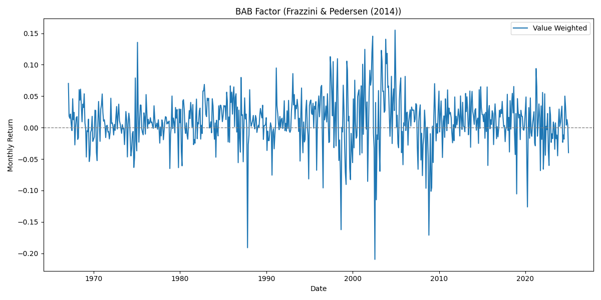
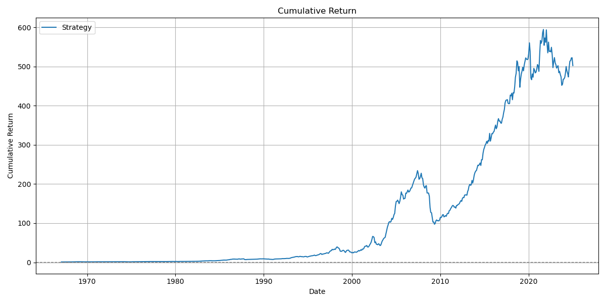
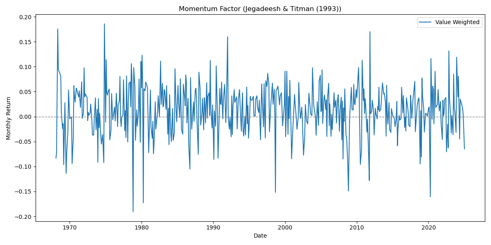
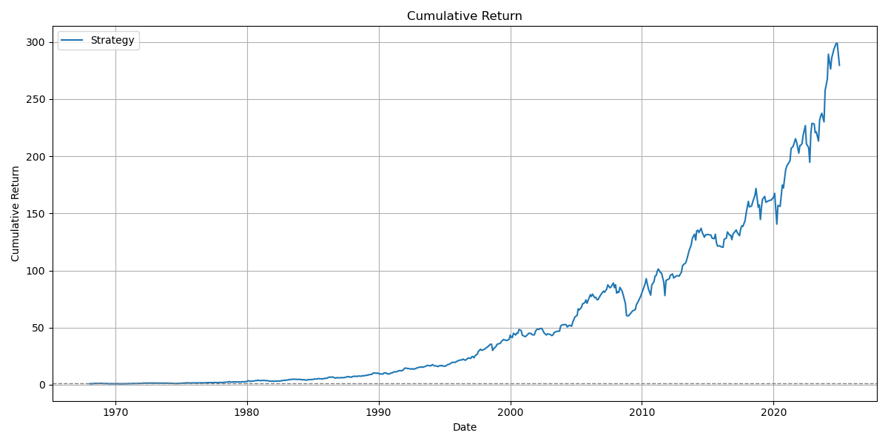
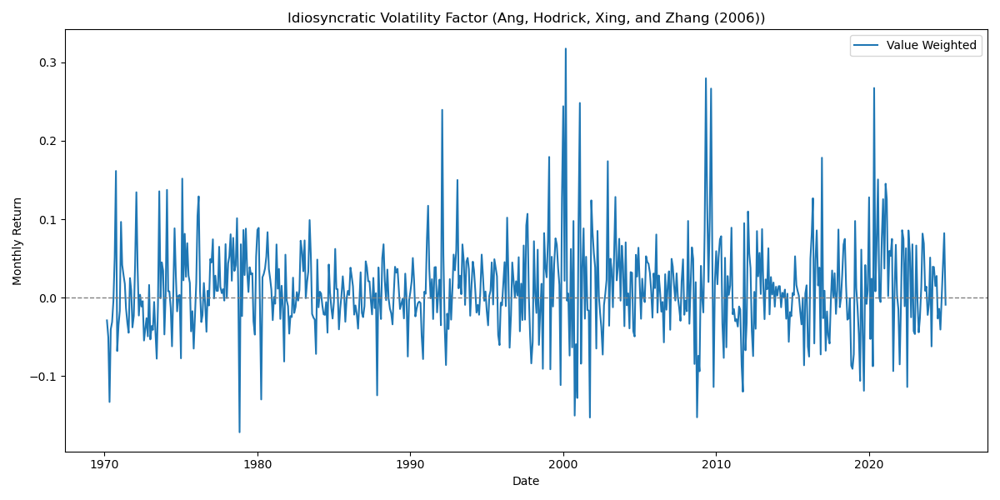
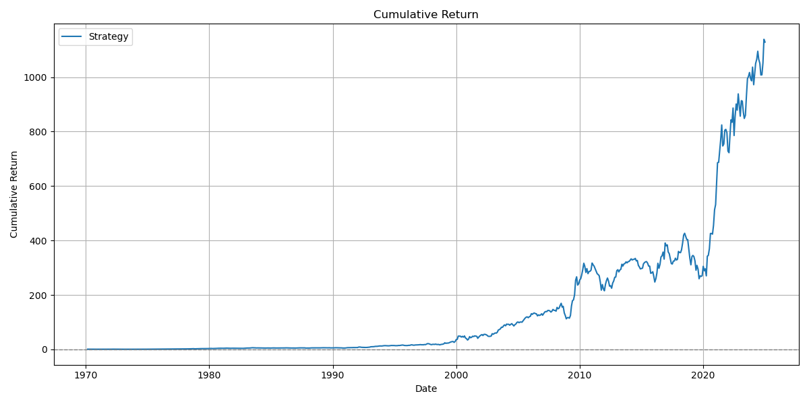
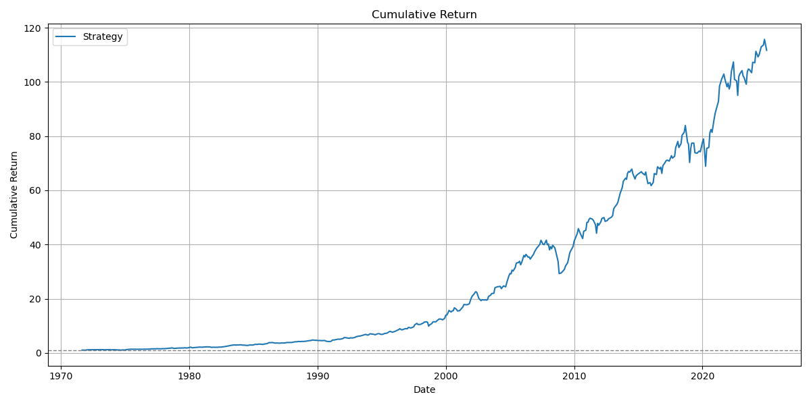
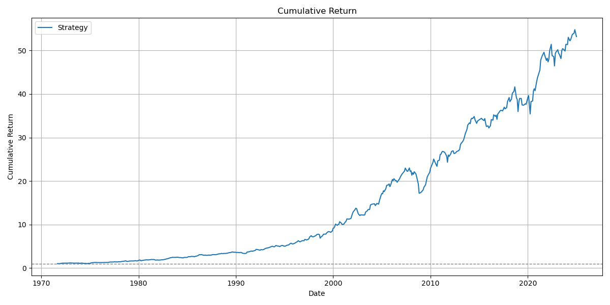

## Optimal Portfolio Construction Using BAB, Momentum, and Volatility Strategies

<!-- TABLE OF CONTENTS -->

  
Table of Contents

  <ol>
    <li><a href="#about-the-project">About the Project</a></li>
    <li><a href="#data">Data</a></li>
    <li><a href="#betting-against-beta">Betting Against Beta</a></li>
    <li><a href="#momentum-strategy">Momentum Strategy</a></li>
    <li><a href="#idiosyncratic-volatility-strategy">Idiosyncratic Volatility Strategy</a></li>
    <li><a href="#optimal-fund-portfolio-return-strat">Optimal Fund Portfolio Return (STRAT)</a></li>
  </ol>

<!-- ABOUT THE PROJECT -->
## About The Project:
This project builds an optimal long-short portfolio based on three empirical asset pricing strategies; Betting Against Beta (BAB), Momentum, and Idiosyncratic Volatility. 
Using daily U.S. equity data from CRSP via WRDS (1970–2025), the portfolio is constructed using both equal-weighted and risk parity. The final fund targets a volatility of 10%.

<!-- Data -->
## Data:

- **Source**: CRSP (via WRDS)
- **Frequency**: Monthly
- **Period**: January 1, 1964 – March 25, 2025
- **Universe**: All common stocks traded on NYSE and AMEX
- **Exclusions**: Short-squeeze tickers fueled by Reddit activity (e.g., GME, AMC, etc.)
- **Market Return**: Value-weighted CRSP market return
- **Risk-Free Rate**: 1-month T-bill returns

<!-- Betting Against Beta -->
## Betting Against Beta:

The **Betting Against Beta (BAB)** strategy follows the methodology of *Frazzini & Pedersen (2014)*. The goal is to construct a market-neutral portfolio that goes long low-beta stocks and short high-beta stocks.

### Construction Steps:

- **1. Estimate Betas**
  - For each stock, compute rolling 5-year monthly regressions of excess returns on the excess market return.
  - Require at least 36 months of valid data per stock.
  - Winsorize betas at the 5th and 95th percentiles.

- **2. Sort into Deciles**
  - At each month *t*, sort stocks into deciles based on estimated beta.
  - Form 10 decile value-weighted portfolios.
  - 
- **3. Construct Long/Short Portfolios**
  - Rank stocks by beta: `z = rank(βₙ)`
  - Define the average rank: `z̄`
  - Create portfolio weights:
    - `w_H = k(z - z̄)⁺` (high beta portfolio)
    - `w_L = k(z - z̄)⁻` (low beta portfolio)
  - Normalize with: `k = 2 / ∑|z - z̄|`

- **4. Compute BAB Return**
- - `Rᵗ⁺¹_L`, `Rᵗ⁺¹_H` are returns of low-beta and high-beta portfolios
- `β_L`, `β_H` are portfolio betas
- `Rf` is the 1-month T-bill rate
- Signal Return: `Rᵗ⁺¹_BAB` = `(Rᵗ⁺¹_L - Rf) / β_L - (Rᵗ⁺¹_H - Rf) / β_H`
- `Rᵗ⁺¹_L`, `Rᵗ⁺¹_H` are returns of low-beta and high-beta portfolios
- `β_L`, `β_H` are portfolio betas
- `Rf` is the 1-month T-bill rate

### Signal Summary Statistics:

| Metric         | Value     |
|----------------|-----------|
| Monthly Mean   | 0.0098    |
| Annual Std Dev | 0.1388    |
| Annual Alpha   | 0.0818    |
| Alpha t-stat   | 5.482     |
| Sharpe Ratio   | 0.847     |

### Monthly Return:

### Accumulative Return:

<!-- Momentum Strategy -->
## Momentum Strategy:

The momentum strategy ranks stocks based on their historical performance, excluding the most recent month to avoid short-term reversal effects. Each portfolio is held for 3 months to reduce turnover and smooth out return volatility.

### Construction Steps:

- **1. Momentum Signal**
  - For each month *t*, calculate cumulative returns from month t−12 to t−2 (skip t−1).
  - Rank stocks based on these past returns into deciles.

- **2. Portfolio Formation**
  - Sort all stocks into 10 deciles.
  - Construct long-short portfolios by:
    - Long: top 3 decile portfolios
    - Short: bottom 3 decile portfolios
  - Portfolios if formed as value-weighted.

- **3. Holding Period**
  - Hold each decile portfolio for 3 months.
  - Final monthly strategy return is the _average_ return of the last 3 overlapping portfolios.

### Signal Summary Statistics:

| Metric         | Value     |
|----------------|-----------|
| Monthly Mean   | 0.0132    |
| Annual Std Dev | 0.1745    |
| Annual Alpha   | 0.0905    |
| Alpha t-stat   | 7.2618    |
| Sharpe Ratio   | 0.9045    |

### Monthly Return:

### Accumulative Return:

<!-- Idiosyncratic Volatility Strategy -->
## Idiosyncratic Volatility Strategy:

This strategy examines whether stocks with lower idiosyncratic volatility outperform those with higher idiosyncratic volatility — contrary to what standard risk-based models like CAPM would suggest.

### Construction Steps:

- **1. Portfolio Formation**
  - For each stock, estimate idiosyncratic volatility as the standard deviation of residuals from rolling 5-year monthly CAPM regressions (skip month t).
  - Require at least 36 months of valid data per stock.
  - Winsorize the volatility at the 5th and 95th percentiles.
  - Each month *t*, rank stocks based on their estimated idiosyncratic volatility.
  - Sort them into 10 decile value-weighted portfolios.
  - Form a long-short portfolio:
    - Long: bottom 3 lowest volatility deciles
    - Short: top 3 highest volatility deciles

### Signal Summary Statistics:

| Metric         | Value     |
|----------------|-----------|
| Monthly Mean   | 0.0123    |
| Annual Std Dev | 0.2019    |
| Annual Alpha   | 0.1025    |
| Alpha t-stat   | 4.3080    |
| Sharpe Ratio   | 0.7345    |

### Monthly Return:

### Accumulative Return:

<!-- OPTIMAL FUND PORTFOLIO -->
## Optimal Fund Portfolio Return (STRAT):

I construct a fund that combines three mentioned long-short strategies into a single overlay portfolio. The goal is to generate a strategy with an annualized target volatility of 10%, while the core portfolio remains invested in 1-month T-Bills.

The fund return is defined as:
Where:
- `R_fund` = `R_T-Bill + c × R_STRAT`
- `R_STRAT` is the return of the combined strategy (BAB, MoM, IV)
- `c` is a scaling constant that ensures the volatility of c × R_STRAT equals 10% annually. 

### Approaches to Combine Strategies:

- **Equal Weighting**:  
  Simply assigns 1/3 to each strategy.

- **Risk Parity**:  
  Allocates capital so that each strategy contributes equally to total portfolio volatility, using a rolling window estimate of volatility.

### STRAT portfolio Summary Statistics:

| Method            | Mean Return | Target Volatility | Sharpe Ratio |
|-------------------|-------------|-------------------|--------------|
| Equal Weight      | 0.1082      | 0.10              | 1.0821       |
| Risk Parity       | 0.1112      | 0.10              | 1.1122       |

### Accumulative Return of STRAT Without Annual Volatility Target:

### Accumulative Return of STRAT With Annual Volatility Target of 10% :

